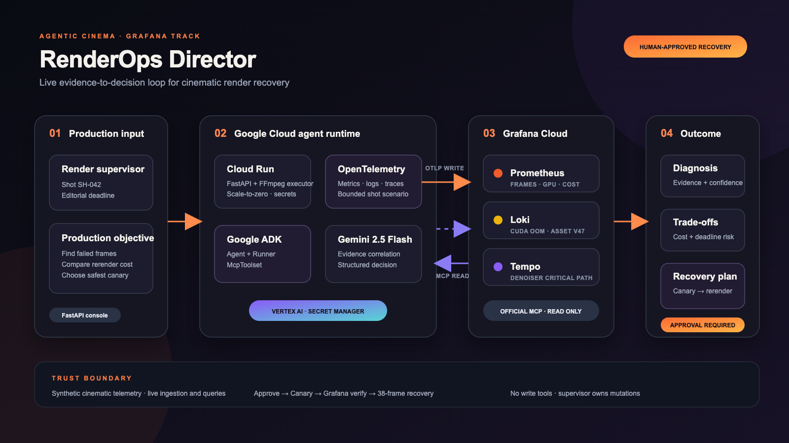
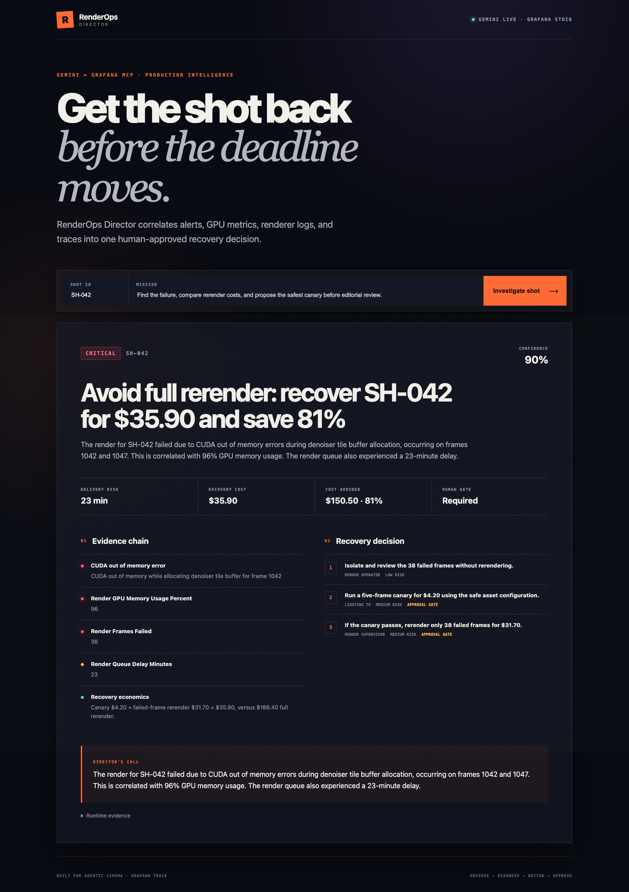

# RenderOps Director

**A Gemini production coordinator that turns failed cinematic frames into the safest, fastest, and most cost-effective recovery decision.**

RenderOps Director is a new submission for the **Agentic Cinema — Grafana track**. It uses Google Agent Development Kit (ADK), Gemini on Vertex AI, and the official Grafana MCP runtime to correlate render-farm alerts, GPU metrics, Loki logs, Tempo traces, and dashboard context. The result is not another alert: it is an evidence-backed, human-approved canary rerender plan.
For the public SH-042 scenario, the recommended path costs $35.90 instead of a $186.40 full
rerender, avoiding $150.50 (about 81%) while protecting the editorial deadline.

**Live demo:** <https://renderops-director-w6mw3t2ita-uc.a.run.app>

The public deployment runs live Google ADK, Gemini on Vertex AI, and official `mcp-grafana`. Before each investigation, a bounded OpenTelemetry scenario sends fresh render metrics, logs, and traces to Grafana Cloud. Gemini then retrieves those signals through read-only MCP calls and prepares the recovery decision.

## Tangible shot preview

The public UI includes an original synthetic VFX shot, a visibly damaged final-denoise render, a
failed-frame timeline, and a side-by-side canary comparison of the exact same frames. Visitors first
see only source and failure states; the canary comparison appears after verification and the full
recovered shot appears only after 38/38 recovery. The footage is original and generated
procedurally for this reproducible demo; it is not third-party studio material.

## Approval-gated recovery loop

After diagnosis, the operator approves a five-frame canary. The application emits a new canary
render phase through Grafana Cloud OTLP, then verifies the result through Prometheus, Loki, and Tempo
MCP calls. Only a validated canary unlocks the 38-frame recovery. A second live verification marks
the final shot editorial ready and unlocks the recovered media preview.

The initial GPU failure scenario is synthetic for reproducibility. Approved canary and recovery
actions execute real FFmpeg media processing inside Cloud Run, return newly generated WebM files to
the browser, and export actual exit code, duration, frame count, output size, logs, and traces for
live Grafana verification.

## Outcome

When a shot starts missing its production deadline, the agent answers:

- Which frames and render passes failed?
- What evidence identifies the root cause?
- Is a full rerender necessary?
- What is the projected delivery delay?
- What bounded canary should run first, and who must approve it?

The project is intentionally focused on **pre-release VFX/render production**, not streaming or premiere operations.

## Architecture



The public path is fully live: a bounded cinematic scenario is exported through Grafana Cloud OTLP,
stored in Prometheus/Loki/Tempo, read back through the official Grafana MCP server, correlated by a
Google ADK agent using Gemini on Vertex AI, and returned as a human-approved recovery decision.

See the editable [SVG](docs/architecture.svg) and [architecture notes](docs/architecture.md).

## Runtime modes

| Mode | Purpose | Data boundary |
| --- | --- | --- |
| `demo` | Public, credential-free product demonstration | Clearly labelled deterministic fictional telemetry |
| `live` + `remote` | Local interactive development | Hosted Grafana Cloud MCP, Streamable HTTP, OAuth 2.1 |
| `live` + `stdio` | Unattended Cloud Run | Official `mcp-grafana` binary and service-account token |

Only read tools are exposed. Grafana write operations and render-farm mutations are outside the MVP safety boundary.

## Run locally

Requirements: Python 3.11+.

```bash
python3.12 -m venv .venv
source .venv/bin/activate
python -m pip install -e '.[dev]'
uvicorn app.main:app --reload
```

Open <http://localhost:8000>.

## Connect hosted Grafana Cloud MCP

```bash
export RENDEROPS_MODE=live
export GRAFANA_MCP_TRANSPORT=remote
export GRAFANA_URL=https://YOUR-STACK.grafana.net
export GOOGLE_CLOUD_PROJECT=YOUR_PROJECT_ID
export GOOGLE_CLOUD_LOCATION=us-central1
export GOOGLE_GENAI_USE_VERTEXAI=true
gcloud auth application-default login
uvicorn app.main:app --reload
```

The first MCP request opens Grafana OAuth authorization. Grant read-only access.

## Connect unattended Grafana MCP

The Docker image includes official `mcp-grafana` v1.3.0. Store the token in Google Secret Manager; never put it in `.env.example`, source code, or deployment logs.

```bash
export RENDEROPS_MODE=live
export GRAFANA_MCP_TRANSPORT=stdio
export GRAFANA_URL=https://YOUR-STACK.grafana.net
export GRAFANA_SERVICE_ACCOUNT_TOKEN='set-from-secret-manager'
uvicorn app.main:app
```

## Seed production-shaped telemetry

The optional seeder emits a bounded shot incident through Grafana Cloud OTLP: nine render metrics,
structured CUDA OOM logs, and a failed denoiser trace. Credentials stay in Secret Manager.

```bash
export RENDEROPS_SEED_TELEMETRY=true
export GRAFANA_OTLP_ENDPOINT=https://YOUR-OTLP-GATEWAY.grafana.net/otlp
export GRAFANA_OTLP_INSTANCE_ID=YOUR_OTLP_INSTANCE_ID
export GRAFANA_OTLP_TOKEN='set-from-secret-manager'
```

This is synthetic domain telemetry, but the ingestion, Grafana storage, MCP queries, Gemini reasoning,
and public response path are all live.

## Verify

```bash
python -m ruff check .
python -m pytest
python -m compileall app
docker build -t renderops-director:test .
```

## Deploy to Google Cloud Run

```bash
./scripts/bootstrap-gcp.sh
./scripts/deploy.sh
```

Deployment defaults to credential-free demo mode. Set the documented live environment variables and
Secret Manager entries to reproduce the public Gemini + Grafana MCP configuration.

## Submission assets

- [Devpost submission copy](docs/devpost-submission.md)

- [Judge testing guide](docs/testing-guide.md)
- [Grafana evidence map](docs/grafana-evidence.md)
- [Architecture PNG](docs/architecture.png) and [SVG](docs/architecture.svg)
- [Production UI screenshot](docs/production-live.png)

## Production screenshot



## Required technologies

- Google Agent Development Kit (`google-adk`)
- Gemini via Vertex AI (`google-genai`)
- Official Grafana MCP via `McpToolset`
- Grafana Cloud: Prometheus-compatible metrics, Loki, Tempo, alerts, dashboards
- Google Cloud Run

## Official references

- [Agentic Cinema Grafana resources](https://agentic-cinema.devpost.com/details/grafana-resources)
- [ADK Grafana Cloud integration](https://github.com/google/adk-docs/blob/main/docs/integrations/grafana-cloud.md)
- [Grafana Cloud MCP](https://grafana.com/docs/grafana-cloud/ai-tools/mcp-servers/cloud-mcp/)
- [Official mcp-grafana](https://github.com/grafana/mcp-grafana)
- [ADK deployment to Cloud Run](https://google.github.io/adk-docs/deploy/cloud-run/)

## License

MIT © 2026 Aleksei Chirkunov
