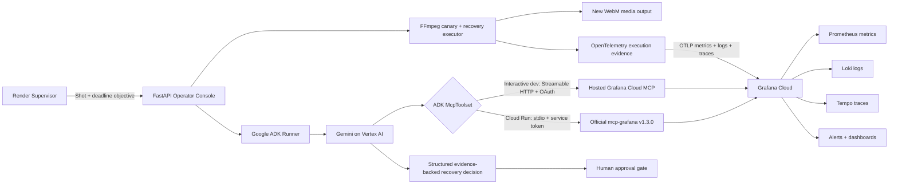

# Architecture

The live agent has a read-only MCP allowlist. It can investigate and prepare a recovery plan, but it cannot alter dashboards, incidents, alerts, infrastructure, or render workloads.
